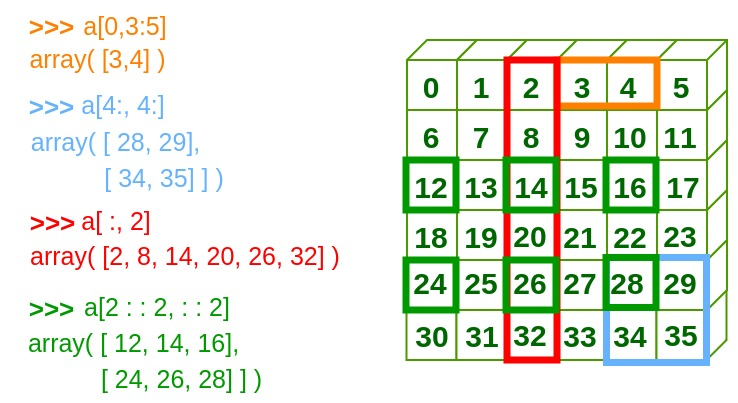

# AI深度學習實戰 (07/01)

## Numpy
### Indexing & Slicing


### Boolean index(Mask)
- Find the elements of a that are bigger than 2：
```javascript=1
a = np.array([[1,2], [3, 4], [5, 6]])
bool_idx = (a > 2)
print(bool_idx)
print(a[bool_idx]) 
```
[[False False]
 [ True  True]
 [ True  True]]
 
[3 4 5 6]

- array & as array
```javascript=1
arr1 = np.ones((3,3))
arr2 = np.array(arr1)
arr3 = np.asarray(arr1)
arr1[1] = 2
```
> arr1 = [[1,1,1],[1,1,1],[1,1,1]]
>
> arr2 = [[1,1,1],[1,1,1],[1,1,1]]
>
> arr3 = [[1,1,1],[2,2,2],[1,1,1]]

==array為copy，而asarray則為View的型態==

### Fancy index
```javascript=1
a = np.arange(10,20)
b = np.array([[1,2,3,4], [5,6,7,8], [9,10,11,12]])
print(a)
print(a[[1,5,8]])
print(b)  
print(b[:,[1,3]])
```
> a = [10 11 12 13 14 15 16 17 18 19]
> 
> a[[1,5,8]] = [11 15 18]
> 
> b=[[ 1  2  3  4]
 [ 5  6  7  8]
 [ 9 10 11 12]]
>
> b[:,[1,3]] = [[ 2  4][ 6  8][10 12]]


### [Broadcasting](https://jakevdp.github.io/PythonDataScienceHandbook/02.05-computation-on-arrays-broadcasting.html)
- newaxis
```javascript=1
a = np.arange(3)
b = np.arange(3)[:, np.newaxis]

print(a)
print(b)
print(a+b)
```
>a = [0 1 2]
>
>b = [[0][1][2]]
>
>a+b = [[0 1 2]
 [1 2 3]
 [2 3 4]]

==np.newaxis為新增維度的功能，用途等同於reshape==

- ndim & matrix_rank 
```javascript=1
a = np.array([1,2,3])
print(a.shape, a.ndim, np.linalg.matrix_rank(a))
b = np.array([[1,2,3],[4,5,6]])
print(b.shape, b.ndim, np.linalg.matrix_rank(b))
```
>(3,) 1 1
>
>(2, 3) 2 2

==ndim功能為判斷維度；linalg.matrix_rank能計算有幾個線性獨立==
> 若b為[[1,2,3],[4,5,6]]經過linalg.matrix_rank則會為2
> 
> 若b為[[1,2,3],[2,4,6]]經過linalg.matrix_rank則會因為`共線性`而為1

- 多維度的運算需注意事項
> ==將對應的兩個array維度對應只能為相同值 or 0 or 1==
> 
> 以下有兩個皆為五個維度的物件
> 
>- [x] (4,2,7,3,2)
> (1,2,7,3,0)
> 
>- [ ] (4,2,7,3,2)
>(1,3,7,3,0) 
> ==第二個元素中為2及3，維度不符合規格，因此會報錯==

### [Stack](https://blog.csdn.net/qq_17550379/article/details/78934529)
- 將兩個物件按照軸或列進行堆疊
```javascript=1
a = np.array([1, 2, 3])
b = np.array([2, 3, 4])

print('a shape {}, b shape {}'.format(a.shape, b.shape))
print(np.stack((a, b), axis=0),np.stack((a, b), axis=0).shape)
print(np.stack((a, b), axis=1),np.stack((a, b), axis=1).shape)
```
>a shape (3,), b shape (3,)
>
>[[1 2 3]
 [2 3 4]] (2, 3)
>
>[[1 2]
 [2 3]
 [3 4]] (3, 2)

---
## is && == 的比較
- is 為判斷兩者間物件是否一樣
- == 為判斷兩者的值是否一樣